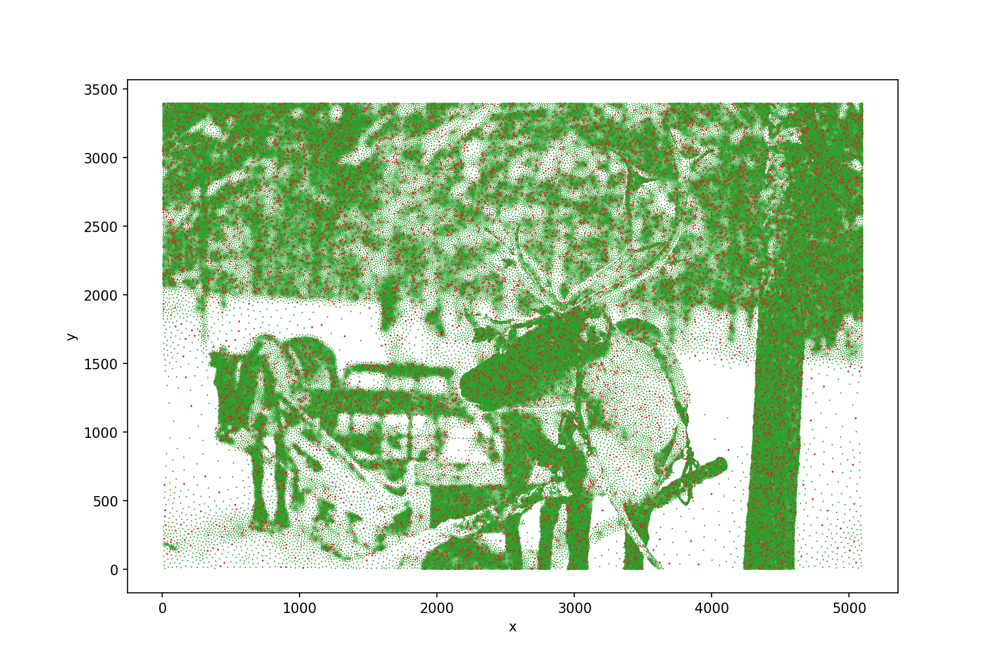

# Kaggle's Travelling Santa 2018 - Prime Paths Problem

This repository contains my solution and Python code to solve Kaggle's [Travelling Santa 2018 - Prime Paths](https://www.kaggle.com/c/traveling-santa-2018-prime-paths) problem that I solved over the Christmas/New Year period 2018/2019.  I didn't have this under version control at the time but have tidied up the code and put it in this repo so I don't lose it.

## Problem

The problem is an [asymmetrical](https://en.wikipedia.org/wiki/Travelling_salesman_problem#Asymmetric_and_symmetric) [Travelling Salesperson Problem](https://en.wikipedia.org/wiki/Travelling_salesman_problem) (TSP) in [Euclidean geometry](https://en.wikipedia.org/wiki/Travelling_salesman_problem#Euclidean) with almost 198000 cities.  The asymmetrical element is appears because if every 10th edge does not originate from a `cityId` that is a prime number then the length of the edge is 10% longer.  One difference from standard TSP problems is that the vertex positions are given as floating point numbers not integers.

The figure below shows the location of all cities in the problem and where the prime city id's are coloured in red.

## Solution

I first experimented with some simple solutions to the problem, such as nearest-neighbour solvers where I picked a starting city, then found the next one by finding the edge with the smallest cost.  These generated solutions but ones that were (as expected) far from optimal.  Since I'd never solved a TSP problem before I built some code to load standard TSP problems and attempt to solve them.

To generate my final solution I wrote code that took the Kaggle problem and turned it into an approximate form that could be solved by highly optimised standard TSP solvers.  I used the [LKH](http://akira.ruc.dk/~keld/research/LKH/) tool which is an implementation of the Lin-Kernighan heuristic.  An approximate form had to be used since the Kaggle problem metric involve the prime and the number of each edge.  To approximate this I used whether the city was a prime number or not to generate an additional $z$ coordinate to produce a 3D problem hoping that this would make LKH pay attention to the prime cities.  Once LKH had a solution I would then use Python to apply small targeted permutations using the full metric for the problem.

